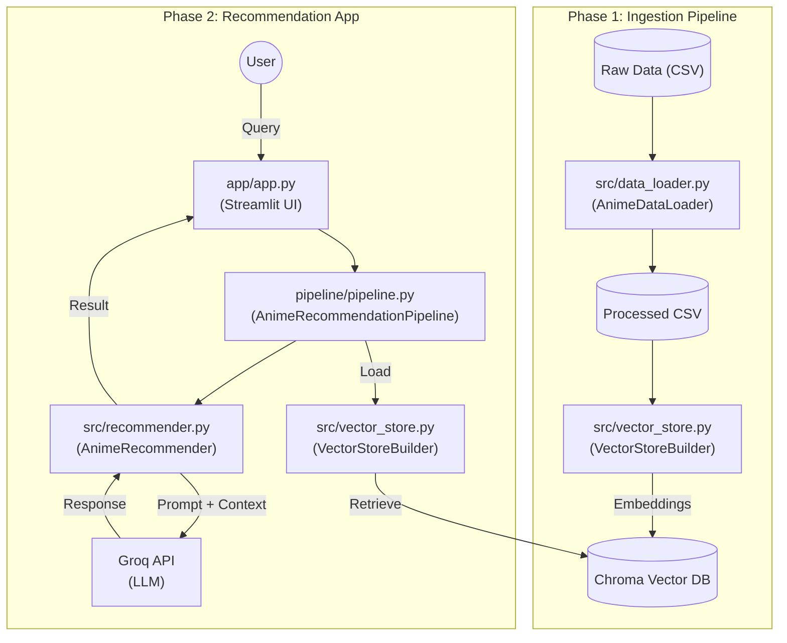

# RAG-Based Anime Recommendation Engine: End-to-End Workflow

This document details the architecture, code navigation, and operational workflow of the current implementation.

## 1. High-Level Architecture

The system operates in two main phases:
1.  **Data Ingestion Pipeline**: Processes raw anime data and serves it into a Vector Database.
2.  **Recommendation Application**: A Streamlit web app that interacts with the Vector Database and an LLM (Groq) to provide recommendations.

## 2. Detailed Code Navigation & Workflow

### Phase 1: Data Ingestion ([pipeline/build_pipeline.py](file:///home/reigen/Downloads/git/RAG-Based-Anime-Recommendation-Engine/pipeline/build_pipeline.py))

This is an offline process run to prepare the data.

1.  **Entry Point**: [pipeline/build_pipeline.py](file:///home/reigen/Downloads/git/RAG-Based-Anime-Recommendation-Engine/pipeline/build_pipeline.py) -> [main()](file:///home/reigen/Downloads/git/RAG-Based-Anime-Recommendation-Engine/pipeline/build_pipeline.py#11-29)
    *   **Action**: Initializes the data loader and vector store builder.
2.  **Data Loading**: [src/data_loader.py](file:///home/reigen/Downloads/git/RAG-Based-Anime-Recommendation-Engine/src/data_loader.py) -> [AnimeDataLoader](file:///home/reigen/Downloads/git/RAG-Based-Anime-Recommendation-Engine/src/data_loader.py#3-24)
    *   **Class**: [AnimeDataLoader](file:///home/reigen/Downloads/git/RAG-Based-Anime-Recommendation-Engine/src/data_loader.py#3-24)
    *   **Method**: [load_and_process()](file:///home/reigen/Downloads/git/RAG-Based-Anime-Recommendation-Engine/src/data_loader.py#8-24)
    *   **Logic**:
        *   Reads [data/anime_with_synopsis.csv](file:///home/reigen/Downloads/git/RAG-Based-Anime-Recommendation-Engine/data/anime_with_synopsis.csv).
        *   Cleans data (drops NaNs).
        *   **Feature Engineering**: Combines `Name`, `sypnopsis` (sic), and `Genres` into a single text column `combined_info`.
        *   Saves this processed data to [data/anime_updated.csv](file:///home/reigen/Downloads/git/RAG-Based-Anime-Recommendation-Engine/data/anime_updated.csv).
3.  **Vector Store Creation**: [src/vector_store.py](file:///home/reigen/Downloads/git/RAG-Based-Anime-Recommendation-Engine/src/vector_store.py) -> [VectorStoreBuilder](file:///home/reigen/Downloads/git/RAG-Based-Anime-Recommendation-Engine/src/vector_store.py#9-32)
    *   **Class**: [VectorStoreBuilder](file:///home/reigen/Downloads/git/RAG-Based-Anime-Recommendation-Engine/src/vector_store.py#9-32)
    *   **Method**: [build_and_save_vectorstore()](file:///home/reigen/Downloads/git/RAG-Based-Anime-Recommendation-Engine/src/vector_store.py#15-29)
    *   **Logic**:
        *   Loads the *processed CSV* using `LangChain`'s `CSVLoader`.
        *   Splits text using `CharacterTextSplitter` (chunk size 1000).
        *   Embeds text using `HuggingFaceEmbeddings` (`all-MiniLM-L6-v2`).
        *   Creates and persists a `Chroma` database in the `chroma_db/` directory.

### Phase 2: Application Runtime ([app/app.py](file:///home/reigen/Downloads/git/RAG-Based-Anime-Recommendation-Engine/app/app.py))

This is the online process when the user runs the app.

1.  **App Startup**: [app/app.py](file:///home/reigen/Downloads/git/RAG-Based-Anime-Recommendation-Engine/app/app.py)
    *   **Logic**:
        *   Sets up the Streamlit page config.
        *   Calls [init_pipeline()](file:///home/reigen/Downloads/git/RAG-Based-Anime-Recommendation-Engine/app/app.py#13-16) decorated with `@st.cache_resource` to ensure the pipeline is loaded only once.
2.  **Pipeline Initialization**: [pipeline/pipeline.py](file:///home/reigen/Downloads/git/RAG-Based-Anime-Recommendation-Engine/pipeline/pipeline.py) -> [AnimeRecommendationPipeline](file:///home/reigen/Downloads/git/RAG-Based-Anime-Recommendation-Engine/pipeline/pipeline.py#9-37)
    *   **Class**: [AnimeRecommendationPipeline](file:///home/reigen/Downloads/git/RAG-Based-Anime-Recommendation-Engine/pipeline/pipeline.py#9-37)
    *   **Method**: [__init__](file:///home/reigen/Downloads/git/RAG-Based-Anime-Recommendation-Engine/src/vector_store.py#10-14)
    *   **Logic**:
        *   Initializes [VectorStoreBuilder](file:///home/reigen/Downloads/git/RAG-Based-Anime-Recommendation-Engine/src/vector_store.py#9-32) pointing to the existing `chroma_db`.
        *   Loads the vector store via [load_vector_store()](file:///home/reigen/Downloads/git/RAG-Based-Anime-Recommendation-Engine/src/vector_store.py#30-32).
        *   Converts the vector store to a **Retriever**.
        *   Initializes [AnimeRecommender](file:///home/reigen/Downloads/git/RAG-Based-Anime-Recommendation-Engine/src/recommender.py#5-21) with this retriever and API keys.
3.  **Core Recommender Logic**: [src/recommender.py](file:///home/reigen/Downloads/git/RAG-Based-Anime-Recommendation-Engine/src/recommender.py) -> [AnimeRecommender](file:///home/reigen/Downloads/git/RAG-Based-Anime-Recommendation-Engine/src/recommender.py#5-21)
    *   **Class**: [AnimeRecommender](file:///home/reigen/Downloads/git/RAG-Based-Anime-Recommendation-Engine/src/recommender.py#5-21)
    *   **Method**: [__init__](file:///home/reigen/Downloads/git/RAG-Based-Anime-Recommendation-Engine/src/vector_store.py#10-14)
        *   Sets up `ChatGroq` as the LLM.
        *   Loads the custom prompt from [src/prompt_template.py](file:///home/reigen/Downloads/git/RAG-Based-Anime-Recommendation-Engine/src/prompt_template.py).
        *   Creates a `RetrievalQA` chain (LangChain) connecting the LLM and the Retriever.

### Phase 3: Recommendation Request Flow

When a user interacts with the UI:

1.  **User Input**: User types a query (e.g., "Naruto but with space pirates") in [app/app.py](file:///home/reigen/Downloads/git/RAG-Based-Anime-Recommendation-Engine/app/app.py).
2.  **Trigger**: `if query:` block executes `pipeline.recommend(query)`.
3.  **Processing**: [pipeline/pipeline.py](file:///home/reigen/Downloads/git/RAG-Based-Anime-Recommendation-Engine/pipeline/pipeline.py)
    *   Logs the query.
    *   Calls `self.recommender.get_recommendation(query)`.
4.  **Retrieval & Generation**: [src/recommender.py](file:///home/reigen/Downloads/git/RAG-Based-Anime-Recommendation-Engine/src/recommender.py)
    *   **Retrieval**: The `RetrievalQA` chain queries the `Chroma` DB for similar anime descriptions (based on the `combined_info` created in Phase 1).
    *   **Prompting**: The retrieved context + user query are inserted into the prompt template.
    *   **Inference**: Sent to Groq LLM.
5.  **Output**: The LLM returns a natural language response with recommendations, which is displayed back in Streamlit via `st.write(response)`.

## Directory Structure Summary

*   **`app/`**: Frontend entry point ([app.py](file:///home/reigen/Downloads/git/RAG-Based-Anime-Recommendation-Engine/app/app.py)).
*   **[pipeline/](file:///home/reigen/Downloads/git/RAG-Based-Anime-Recommendation-Engine/app/app.py#13-16)**: Orchestration scripts ([build_pipeline.py](file:///home/reigen/Downloads/git/RAG-Based-Anime-Recommendation-Engine/pipeline/build_pipeline.py) for ingestion, [pipeline.py](file:///home/reigen/Downloads/git/RAG-Based-Anime-Recommendation-Engine/pipeline/pipeline.py) for runtime logic).
*   **`src/`**: Core business logic modules.
    *   [data_loader.py](file:///home/reigen/Downloads/git/RAG-Based-Anime-Recommendation-Engine/src/data_loader.py): CSV processing.
    *   [vector_store.py](file:///home/reigen/Downloads/git/RAG-Based-Anime-Recommendation-Engine/src/vector_store.py): Embeddings and Database management.
    *   [recommender.py](file:///home/reigen/Downloads/git/RAG-Based-Anime-Recommendation-Engine/src/recommender.py): RAG chain and LLM interaction.
*   **`data/`**: Storage for raw and processed CSVs.
*   **`chroma_db/`**: Persisted Vector Database files.
